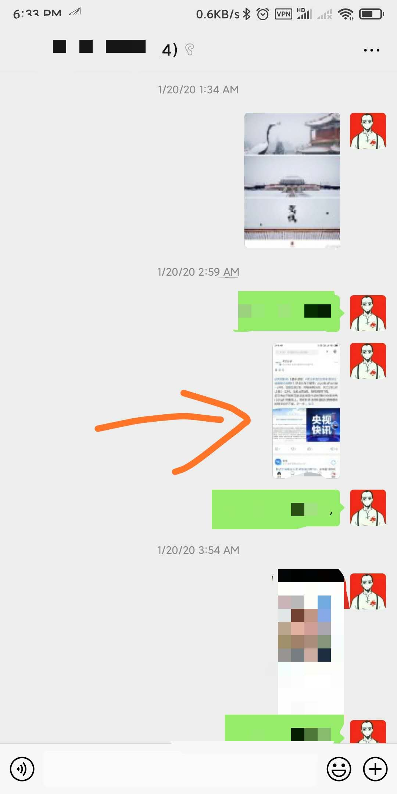

疫情持续至今，已经一月有余。这些天反复回忆，试图复盘从一月初至今，这一个月多以来，我们是否错过了什么消息，导致局面如此不可收拾。是否有一些我们没曾注意到的微小讯号，或是我们被什么消息误导以至于没把这次疫情放在心上？这都是我反复思考，但是都难以获得答案。
我和大学室友有一个小范围的群组，我们常在里面嬉笑怒骂，分享人生喜乐，也可以认为是一个生活之外的树洞。一般无论有什么风吹草动，我们都会第一时间在群里分享相关消息。然而，所谓灵通的群组，最早也是在一月二十日时，我们才开始聊起新冠肺炎的种种故事。

正如我们不把埃博拉病毒，或是H1N1放在心上一般，虽然新冠肺炎的消息暗流涌动了很久，但我们仍然认为这次疫情只会存在于当地，对我们的影响应该最多如蝴蝶效应一般，还需假以时日才能传导到我们身边。最早注意新冠肺炎，应该是一月初，但记不清具体时间节点了。然而，印象深刻的是，一月十四号去新竹马偕医院时，当时的医院门口已有张贴“去过内地武汉的人，如出现发热咳嗽等症状请马上联系医院就诊”等字样的告示。当时对于这个告示，我内心反应是有些反应过度了吧，虽然零星接收到武汉发生肺炎的消息，但是当时都没有传播到武汉之外，台湾便开始反应，是否有过度动作之嫌？加上一些当地媒体对于疫情的指摘，比如疫情的“听话”（指疫情指发生在了湖北），可能存在的消息瞒报等，